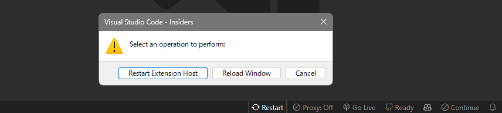

  <h1 align="center">otak-restart</h1>
  
Two-click restart for Extension Host and VSCode window.

---

This extension adds a button to VSCode that lets you restart the Extension Host or reload window with a single click. It streamlines the development process, saving you from having to use the command palette or restart commands during development or troubleshooting, thus improving efficiency and easing debugging.

# Features

- Adds a customizable status bar button for quick access
- Provides two restart options:
  - Restart Extension Host: Restarts only the Extension Host
  - Reload Window: Reloads the entire VS Code window
- Simple one-click access with clear confirmation dialogs

# Usage

1. Click the restart button in the status bar
2. Select your desired operation from the dialog:
   - `Restart Extension Host`: Restarts only the Extension Host process
   - `Reload Window`: Performs a full window reload
   - `Cancel`: Closes the dialog without any action

You can also access the functionality through the Command Palette (F1):

- `Extension Host: Restart Extension Host`
- `Extension Host: Reload Window`
- `Extension Host: Show Restart Options`

## Configuration

This extension can be customized through VS Code settings:

- `otakRestart.buttonPosition`: Position of the button in the status bar
  - Options: `"left"` or `"right"`
  - Default: `"right"`

- `otakRestart.buttonText`: Text to display on the button
  - Default: `"$(sync) Restart"`
  - Note: Supports VS Code icons (e.g., `$(sync)`)

## Requirements

- Visual Studio Code 1.90.0 or higher

## Extension Settings

Available settings:

* `otakRestart.buttonPosition`: Configure button position in status bar (`"left"` or `"right"`)
* `otakRestart.buttonText`: Customize button text with support for VSCode icons

## Troubleshooting

If restart operations are not working:
1. Check if you have unsaved changes
2. Ensure no critical operations are in progress
3. Try using the Command Palette commands if the status bar button is not responding

## License

MIT License - see the LICENSE file for details.

---

For more information, visit the [GitHub repository](https://github.com/tsuyoshi-otake-system-exe-jp/otak-restart).
